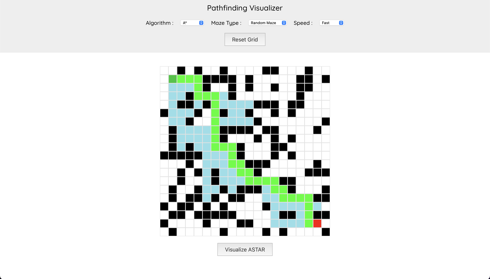

# Pathfinding Visualizer

Pathfinding Visualizer is a web application built with `React` that allows users to visualize different pathfinding algorithms on a grid. The application supports wall drawing, maze generation, and algorithm visualization with adjustable speeds.

## Demo

Click [here](http://dan10ish.github.io/pathfinding-visualizer/) to view the live project.

## Features

- **Pathfinding Algorithms**: Visualize the following algorithms:

  - Dijkstra
  - Breadth-First Search (BFS)
  - Depth-First Search (DFS)
  - A\*

- **Maze Generation**: Generate mazes with different types:

  - None
  - Random Maze
  - Recursive Maze

- **Speed Control**: Adjust the speed of the visualization:

  - Fast
  - Medium
  - Slow

- **Wall Drawing**: Draw and remove walls to create obstacles for the algorithms.

## Screenshots



## Getting Started

Follow these instructions to get a copy of the project up and running on your local machine for development and testing purposes.

### Prerequisites

Ensure you have the following installed:

- Node.js
- npm (Node Package Manager)

### Installation

1. Clone the repository:

   ```bash
   git clone https://github.com/dan10ish/pathfinding-visualizer.git
   ```

2. Navigate to the project directory:

   ```bash
   cd pathfinding-visualizer
   ```

3. Install the dependencies

   ```bash
   npm install
   ```

### Running the Application

Start the development server:

  ```bash
    npm start
  ```

Open your browser and navigate to http://localhost:3000 to see the application in action.

### Usage

1. Select Algorithm: Choose a pathfinding algorithm from the dropdown menu.
2. Select Maze Type: Choose a maze type to generate a maze on the grid.
3. Select Speed: Adjust the visualization speed.
4. Draw Walls: Click on the grid cells to draw or remove walls.
5. Visualize: Click the “Visualize” button to start the algorithm visualization.
